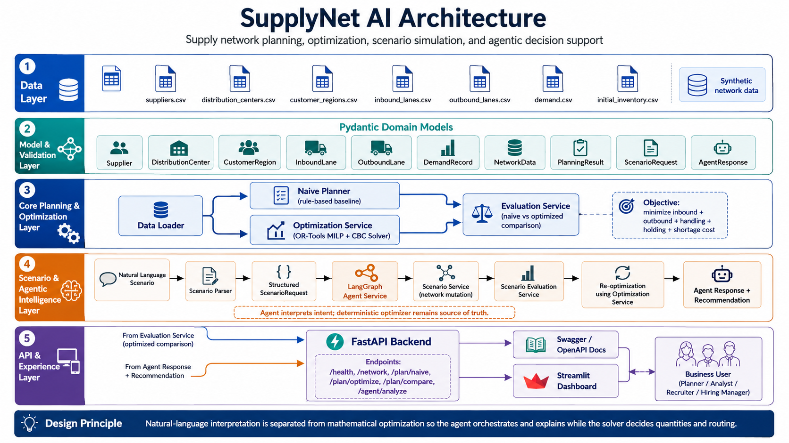

# SupplyNet AI

**SupplyNet AI** is an end-to-end supply network planning, optimization, and disruption-analysis platform.

It combines a rule-based planning baseline, deterministic mixed-integer optimization, scenario simulation, and an agentic natural-language interface to answer questions such as:

> "Increase West demand by 20% in week 1."

> "Reduce Dallas capacity by 30%."

> "SUP_001 supplier outage in week 1."

Instead of allowing an AI agent to directly decide shipment quantities, SupplyNet AI separates **natural-language interpretation** from **mathematical optimization**.

The agent interprets and orchestrates the scenario, while an **OR-Tools MILP optimizer** remains the source of truth for routing, container bookings, shipment quantities, fulfillment, and network cost.

---

## Project Highlights

The synthetic supply network currently models:

| Component | Scale |
|---|---:|
| Suppliers | 25 |
| Active Suppliers | 23 |
| Distribution Centers | 4 |
| Customer Regions | 8 |
| Inbound Supplier → DC Lanes | 100 |
| Available Inbound Lanes | 96 |
| Outbound DC → Region Lanes | 32 |
| Planning Horizon | 4 weeks |

For the Week 1 baseline scenario:

| Metric | Rule-Based Baseline | Optimized Plan |
|---|---:|---:|
| Total Network Cost | ~$1.122M | ~$1.034M |
| Customer Fulfillment | 100.00% | 100.00% |
| Unmet Demand | 0 pallets | 0 pallets |
| Container Utilization | ~97.36% | ~99.88% |

### Result

**~7.83% reduction in total network cost while maintaining 100% customer fulfillment.**

The optimization also increased container utilization by approximately **2.53 percentage points**.

> These results are generated from synthetic portfolio data and should be interpreted as a demonstration of the architecture and optimization approach rather than production business results.

---

# Architecture

SupplyNet AI is organized as a layered decision-support system covering data ingestion, validation, planning, optimization, scenario simulation, agent orchestration, APIs, and user experience.

<p align="center">
  
</p>

## Architecture Layers

### 1. Data Layer

The project uses synthetic CSV datasets representing the supply network:

- `suppliers.csv`
- `distribution_centers.csv`
- `customer_regions.csv`
- `inbound_lanes.csv`
- `outbound_lanes.csv`
- `demand.csv`
- `initial_inventory.csv`

The generated network contains supplier capacity, DC capacity, demand, inventory, geographic information, transportation cost, container capacity, lead time, reliability, and lane availability.

---

### 2. Model & Validation Layer

Pydantic provides typed contracts and validation across the application.

Core models include:

- `Supplier`
- `DistributionCenter`
- `CustomerRegion`
- `InboundLane`
- `OutboundLane`
- `DemandRecord`
- `NetworkData`
- `PlanningResult`
- `ScenarioRequest`
- `AgentResponse`

Referential-integrity checks help ensure that lane, supplier, DC, region, and demand identifiers remain consistent before optimization begins.

---

### 3. Core Planning & Optimization Layer

SupplyNet AI implements two planning approaches.

#### Rule-Based Naive Planner

The baseline planner makes sequential operational decisions:

1. assign customer regions to their cheapest available DC;
2. consume initial DC inventory;
3. rank inbound supplier lanes by nominal cost;
4. procure remaining demand subject to supplier and DC capacity;
5. book whole containers;
6. fulfill customer demand from available DC inventory;
7. calculate transportation, handling, holding, and shortage cost.

The baseline is intentionally heuristic and does **not** guarantee global optimality.

#### MILP Optimization Service

The optimized planner is implemented using:

- **Google OR-Tools**
- **CBC mixed-integer solver**

The optimizer simultaneously determines:

- supplier → DC pallet flows;
- integer container bookings;
- DC → customer-region flows;
- ending DC inventory;
- unmet regional demand.

The model minimizes total supply-network cost globally.

---

# Optimization Model

## Objective

The optimizer minimizes:

```text
Total Cost
=
Inbound Container Transportation
+ Outbound Transportation
+ DC Handling
+ Inventory Holding
+ Unmet Demand Penalty
```

## Decision Variables

Conceptually, the model contains:

```text
x[s,d] = pallets shipped from supplier s to DC d

y[s,d] = number of containers booked from supplier s to DC d

z[d,r] = pallets shipped from DC d to customer region r

I[d] = ending inventory at DC d

u[r] = unmet demand in customer region r
```

## Constraints

The optimization currently enforces:

### Supplier Capacity

```text
Total pallets sourced from supplier
<=
Supplier weekly capacity
```

### Container Capacity

```text
Inbound pallets
<=
Containers booked × pallets per container
```

### Distribution Center Receiving Capacity

```text
Total inbound pallets to DC
<=
DC receiving capacity
```

### DC Flow Balance

```text
Initial Inventory + Inbound
=
Outbound + Ending Inventory
```

### Storage Capacity

```text
Ending Inventory
<=
DC storage capacity
```

### Customer Demand Balance

```text
Outbound Fulfillment + Unmet Demand
=
Regional Demand
```

### Lane Availability

Unavailable inbound and outbound transportation lanes are forced to zero flow.

---

# Naive vs Optimized Evaluation

`EvaluationService` runs both planning strategies against the same network and planning week.

It calculates:

- total cost;
- inbound transportation cost;
- outbound transportation cost;
- handling cost;
- inventory holding cost;
- shortage cost;
- customer fulfillment;
- unmet demand;
- container utilization;
- absolute savings;
- percentage savings.

For Week 1, the optimized solution currently produces approximately:

```text
Naive Cost:      $1.122M
Optimized Cost:  $1.034M

Savings:         ~$87.8K
Savings Rate:    ~7.83%

Naive Fulfillment:      100%
Optimized Fulfillment:  100%

Naive Container Utilization:      ~97.36%
Optimized Container Utilization:  ~99.88%
```

---

# Scenario Simulation

SupplyNet AI can mutate a copy of the original network and rerun optimization without modifying the base dataset.

Supported disruption types include:

- demand surge;
- supplier outage;
- supplier capacity reduction;
- DC capacity reduction;
- inbound transportation-cost increase;
- inbound lane disruption;
- outbound lane disruption.

Examples:

```text
Increase West demand by 20% in week 1
```

```text
Reduce Dallas capacity by 30% in week 1
```

```text
SUP_001 supplier outage in week 1
```

The `ScenarioEvaluationService` compares:

```text
Baseline optimized network
        vs
Disrupted optimized network
```

and returns changes in:

- total cost;
- cost percentage;
- fulfillment;
- unmet demand.

---

# Agentic Scenario Analysis

The agentic layer is implemented using **LangGraph**.

The workflow is:

```text
Natural-Language Request
          ↓
Scenario Parser
          ↓
Validated ScenarioRequest
          ↓
LangGraph Agent Workflow
          ↓
Scenario Service
          ↓
Network Mutation
          ↓
Scenario Evaluation
          ↓
OR-Tools Re-optimization
          ↓
Impact Analysis
          ↓
Business Recommendation
```

For example:

```text
Increase West demand by 20% in week 1
```

is converted into structured parameters similar to:

```json
{
  "scenario_type": "demand_surge",
  "week": 1,
  "region_id": "REG_WEST",
  "percentage": 0.20
}
```

The scenario is then validated, applied to a copied network, and passed back through the optimization engine.

## Important Design Principle

The agent does **not** calculate shipment quantities itself.

Instead:

### Agent responsibilities

- interpret operational intent;
- extract scenario parameters;
- validate the scenario;
- orchestrate the workflow;
- compare business impact;
- generate recommendations.

### Optimizer responsibilities

- determine supplier allocations;
- determine DC routing;
- book containers;
- calculate shipment quantities;
- satisfy constraints;
- minimize network cost.

This architecture keeps numerical supply-planning decisions deterministic and auditable.

---

# FastAPI Backend

SupplyNet AI exposes the planning system through FastAPI.

Current endpoints:

```text
GET  /health

GET  /network

POST /plan/naive

POST /plan/optimize

POST /plan/compare

POST /agent/analyze
```

## Example Agent Request

```json
{
  "query": "Increase West demand by 20% in week 1"
}
```

Interactive API documentation is available at:

```text
http://127.0.0.1:8000/docs
```

when the backend is running locally.

---

# Streamlit Dashboard

The Streamlit application provides an interactive business-facing interface.

The dashboard includes:

- network overview;
- planning-week selector;
- naive vs optimized cost comparison;
- cost savings;
- solver status;
- customer fulfillment;
- unmet demand;
- container utilization;
- cost-component analysis;
- inbound allocations;
- outbound allocations;
- ending inventory;
- AI scenario analyst;
- business recommendations.

The dashboard runs at:

```text
http://localhost:8501
```

when launched locally.

---

# Technology Stack

## Optimization & Analytics

- Python
- Google OR-Tools
- CBC MILP Solver
- Pandas

## Agentic Workflow

- LangGraph
- Pydantic
- deterministic natural-language scenario parsing

## Backend

- FastAPI
- Uvicorn

## Frontend

- Streamlit

## Testing

- Pytest

## Engineering / Packaging

- Git
- GitHub
- GitHub Actions
- Dockerfile

---

# Repository Structure

```text
supplynet-ai/
│
├── app/
│   │
│   ├── main.py
│   │
│   ├── models/
│   │   ├── supplier.py
│   │   ├── distribution_center.py
│   │   ├── customer_region.py
│   │   ├── inbound_lane.py
│   │   ├── outbound_lane.py
│   │   ├── demand_record.py
│   │   ├── network_data.py
│   │   ├── planning_result.py
│   │   └── scenario.py
│   │
│   └── services/
│       ├── data_loader.py
│       ├── naive_planner.py
│       ├── optimization_service.py
│       ├── evaluation_service.py
│       ├── scenario_service.py
│       ├── scenario_evaluation_service.py
│       ├── scenario_parser.py
│       └── agent_service.py
│
├── assets/
│   └── supplynet-ai-architecture.png
│
├── data/
│   ├── suppliers.csv
│   ├── distribution_centers.csv
│   ├── customer_regions.csv
│   ├── inbound_lanes.csv
│   ├── outbound_lanes.csv
│   ├── demand.csv
│   └── initial_inventory.csv
│
├── docs/
│   └── optimization_model.md
│
├── scripts/
│   ├── generate_data.py
│   └── inspect_data.py
│
├── tests/
│   ├── test_data_loader.py
│   ├── test_naive_planner.py
│   ├── test_optimizer.py
│   └── test_agent.py
│
├── .github/
│   └── workflows/
│       └── tests.yml
│
├── streamlit_app.py
├── requirements.txt
├── Dockerfile
├── .dockerignore
├── .env.example
├── .gitignore
└── README.md
```

---

# Running the Project Locally

## 1. Clone the repository

```bash
git clone <YOUR_REPOSITORY_URL>
cd supplynet-ai
```

Replace `<YOUR_REPOSITORY_URL>` with your GitHub repository URL.

---

## 2. Create a virtual environment

```bash
python -m venv .venv
```

Activate it on macOS/Linux:

```bash
source .venv/bin/activate
```

---

## 3. Install dependencies

```bash
pip install -r requirements.txt
```

---

## 4. Run tests

```bash
pytest -q
```

The current test suite contains **27 passing tests** covering the core planning and agent workflows.

---

## 5. Start the FastAPI backend

```bash
uvicorn app.main:app --reload
```

Then open:

```text
http://127.0.0.1:8000/docs
```

---

## 6. Start Streamlit

Open another terminal:

```bash
source .venv/bin/activate
```

Then:

```bash
streamlit run streamlit_app.py
```

Open:

```text
http://localhost:8501
```

---

# Testing Strategy

The automated test suite covers several levels of the application.

## Data Validation

Tests verify:

- expected entity counts;
- identifier uniqueness;
- lane references;
- supplier/DC/region references;
- capacity consistency;
- sufficient network supply.

## Rule-Based Planner

Tests verify:

- planning execution;
- service metrics;
- container utilization;
- supplier capacity;
- container capacity;
- lane availability.

## Optimization Model

Tests verify:

- successful solver execution;
- supplier capacity;
- container capacity;
- DC receiving capacity;
- DC flow balance;
- demand balance;
- unavailable-lane enforcement.

## Agentic Workflow

Tests verify:

- demand-surge parsing;
- DC-capacity parsing;
- supplier-outage parsing;
- invalid-input rejection;
- successful agent execution;
- preservation of the original base network.

---

# Synthetic Data Generation

The repository includes a deterministic synthetic-data generator.

The generator uses a fixed random seed to build a reproducible supply network.

It creates:

```text
25 suppliers
4 distribution centers
8 customer regions
100 inbound lanes
32 outbound lanes
4 weeks of regional demand
```

The generated data is intended specifically for demonstration, testing, and portfolio use.

---

# Current Scope

SupplyNet AI V1 currently performs **single-week optimization** for a selected planning week.

Initial inventory is included in the DC flow balance for the selected week, but inventory is not yet carried automatically between successive planning periods.

---

# Future Enhancements

Potential extensions include:

### Multi-Period Optimization

Carry ending inventory from one period into the next and optimize several weeks jointly.

### Lead-Time-Aware Planning

Include transportation lead times directly in network decisions.

### Safety Stock

Introduce minimum safety-stock requirements by DC.

### Supplier Reliability

Incorporate reliability scores directly into the optimization objective or constraints.

### Multi-Objective Optimization

Optimize combinations of:

- cost;
- fulfillment;
- transportation emissions;
- supplier risk;
- inventory exposure.

### Stochastic Optimization

Model uncertainty in:

- demand;
- supplier availability;
- transportation cost;
- lead time.

### Persistence Layer

Store scenarios and optimization results in PostgreSQL.

### LLM-Based Structured Extraction

Replace or complement the deterministic scenario parser with schema-constrained LLM extraction while retaining validation and deterministic optimization.

### Observability

Add:

- structured logging;
- tracing;
- solver execution metrics;
- scenario audit trails.

### Authentication & RBAC

Introduce role-based access for planners, analysts, and administrators.

---

# Why This Project

Supply-network decisions often involve both:

1. **structured mathematical decisions**, such as allocation, capacity, routing, and cost minimization; and
2. **unstructured operational questions**, such as disruptions, demand changes, or supplier issues.

SupplyNet AI explores an architecture where these responsibilities are deliberately separated:

```text
AI / Agent
→ Understand intent
→ Orchestrate

Optimization Engine
→ Calculate decisions
→ Enforce constraints
```

The goal is not to replace deterministic planning with an LLM.

The goal is to make deterministic planning systems **easier to query, simulate, and explain** using an agentic interface.

---

# Disclaimer

This project uses **synthetic data** and was developed as a portfolio / engineering demonstration.

The reported savings and operational metrics are outputs of the synthetic network and should not be interpreted as results from a production business network.

---

## Author

Built as an end-to-end demonstration of:

**Supply Chain Optimization × Operations Research × Data Engineering × Agentic AI**
